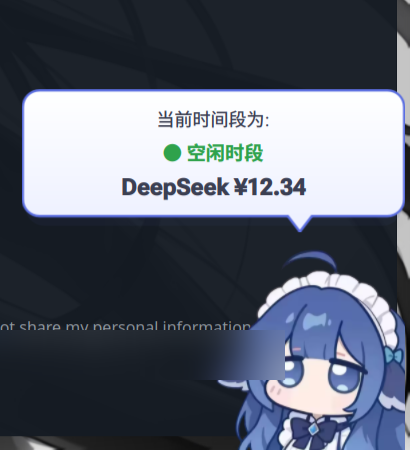
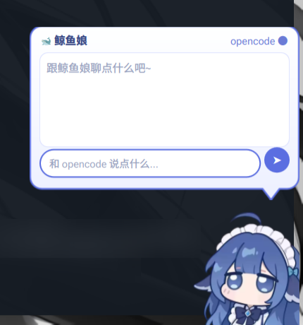

# DSH 小鲸鱼桌面宠物(quickshell 版)

> [!IMPORTANT]
> **原项目**:[DeepSeek-Balance-Whale-Widget](https://github.com/MeteorNOX/DeepSeek-Balance-Whale-Widget)
> **原作者**:[MeteorNOX](https://github.com/MeteorNOX)(MIT License,© 2026)
> 本项目是原项目的 **Wayland 桌面宠物衍生版**,立绘、rua.gif、音效与部分台词均来自原项目,版权归原作者所有,感谢!

基于 quickshell 的 layer-shell 实现,常驻置顶悬浮,适配 niri(其他 wlroots 系合成器理论上可用)。

<table>
  <tr>
    <td></td>
    <td></td>
  </tr>
  <tr><td align="center">左键 · 随机台词气泡</td><td align="center">思考泡泡样式,右键看余额</td></tr>
</table>

## 运行

```sh
~/Documents/Project/quickshell-pet/run.sh          # 启动(已启动则跳过)
~/Documents/Project/quickshell-pet/run.sh stop     # 退出
~/Documents/Project/quickshell-pet/run.sh restart  # 重启
```

不会影响 caelestia shell(独立目录,独立实例)。

## 交互

| 操作 | 效果 |
| --- | --- |
| 左键点鲸鱼 | Q 弹 + 音效 + 随机台词气泡(含各家余额/峰谷提示,5 秒自动收起) |
| 再点气泡 | 换一段随机台词 |
| 右键鲸鱼 | 峰谷时段 + 各家余额气泡(有气泡时先关闭) |
| 拖拽 | 移动位置,靠近左/右边缘自动吸附;吸到左边整体水平镜像 |

## 配置

所有设置集中在 **`~/.config/dsh-pet/config.json`**(没有就自动生成默认值),
**保存后约 2 秒内自动生效,无需重启**:

```json
{
  "scale": 0.8,             // 缩放,0.6 – 2.5
  "sound": true,            // 音效开关
  "soundSet": "duck",       // duck = 小黄鸭(Ya1/Ya2),fx1 = 音效1(D1/D2)
  "edgePad": 3,             // 窗口左右内衬 px,越小贴边越紧
  "snapZone": 0.22,         // 左右吸附区占屏幕宽度的比例
  "idleTalk": true,         // 发呆自言自语
  "idleTalkMinutes": 5,     // 自言自语平均间隔(分钟,实际随机 ±50%)
  "idleTalkChance": 0.4     // 每次触发说话的概率 0 – 1
}
```

鲸鱼在屏幕上的位置(`state.json` 里的 `petX` / `mirrored`)由拖拽自动记忆,不用手动改。

## 多家余额(可选)

`config.json` 的 `balance` 数组,想报谁的余额就填谁:

```json
"balance": [
  { "name": "DeepSeek",  "type": "deepseek",    "apiKey": "" },
  { "name": "OpenRouter", "type": "openrouter", "apiKey": "sk-or-..." },
  { "name": "硅基流动",   "type": "siliconflow", "apiKey": "sk-..." }
]
```

- `deepseek`:空 apiKey 时自动读 `~/.config/dsh-pet/api_key` 或环境变量 `DEEPSEEK_API_KEY`(兼容旧配置)
- `openrouter`:空时读环境变量 `OPENROUTER_API_KEY`;余额 = 总额度 - 已用
- `siliconflow`:空时读环境变量 `SILICONFLOW_API_KEY`
- 右键鲸鱼即可看到各家余额,每 60 秒刷新一次
- 全都不配置也不影响其他功能,只是余额台词变成随机卖萌文案

## 开机自启

在 `~/.config/niri/config.kdl` 里加一行:

```kdl
spawn-at-startup "sh" "-c" "$HOME/Documents/Project/quickshell-pet/run.sh"
```

## 文件结构

```
quickshell-pet/
├── shell.qml        # 宠物本体(layer-shell 置顶、气泡、拖拽吸附、动画、音效)
├── run.sh           # 启动器(start / stop / restart)
├── README.md
└── assets/          # 复制自原插件:立绘 / rua.gif / 两组音效
```

## 致谢

- 🐋 立绘、rua.gif、音效素材与部分台词均来自 [DeepSeek-Balance-Whale-Widget](https://github.com/MeteorNOX/DeepSeek-Balance-Whale-Widget)(© 2026 MeteorNOX,MIT License),本项目为其衍生作品,感谢原作者!
- 本项目同样以 [MIT License](LICENSE) 开源;assets/ 目录内容的版权归属见 LICENSE 中的 Third-party notices。
